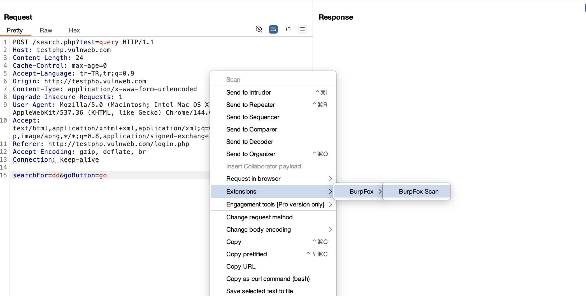
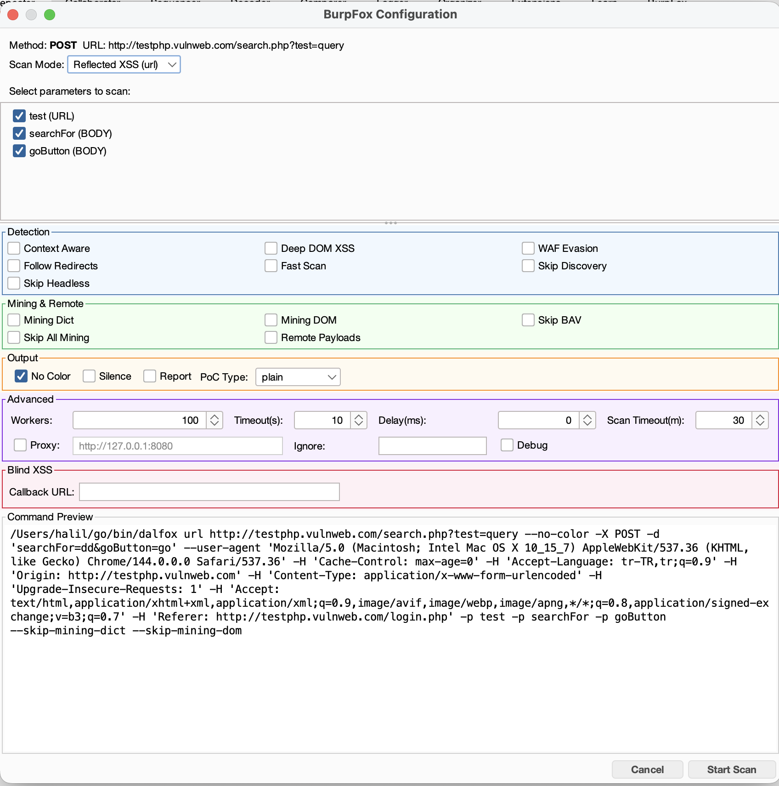
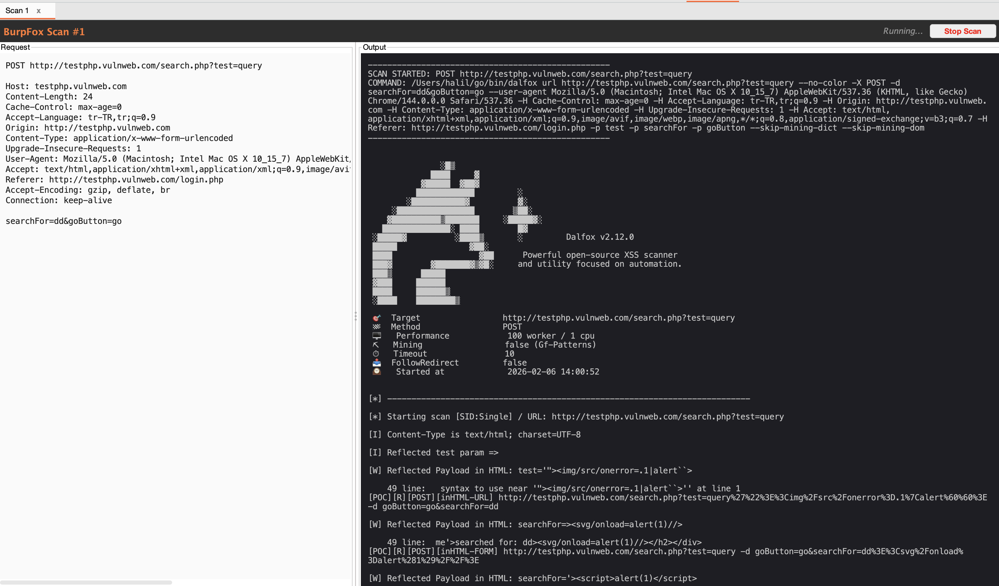

# 🦊 BurpFox

A Burp Suite extension that integrates [Dalfox](https://github.com/hahwul/dalfox) XSS scanner directly into your workflow.


## Features

- 🎯 **Right-click scanning** - Scan requests directly from Proxy History or Repeater.
- ⚙️ **Full Dalfox options** - Context-aware, WAF evasion, Blind XSS and more.

## Prerequisites

### 1. Install Dalfox

Dalfox must be installed on your system before using BurpFox.

**macOS (Homebrew):**
```bash
brew install dalfox
```

**Linux (Go):**
```bash
go install github.com/hahwul/dalfox/v2@latest
```

**Verify installation:**
```bash
dalfox version
```

> **Note:** Ensure `dalfox` is in your PATH. BurpFox also checks common locations like `~/go/bin/dalfox` and `/usr/local/bin/dalfox`.

## Installation

### Option A: Download Release (Recommended)

1. Download the latest `burpfox-x.x.jar` from [Releases](https://github.com/halilkirazkaya/burpfox/releases)
2. Open Burp Suite
3. Go to **Extensions** → **Installed** → **Add**
4. Select **Extension type: Java**
5. Click **Select file** and choose the downloaded JAR
6. Click **Next** to load the extension

### Option B: Build from Source

**Requirements:**
- Java 17+
- Maven 3.6+

```bash
# Clone the repository
git clone https://github.com/halilkirazkaya/burpfox.git
cd burpfox

# Build
mvn clean package

# The JAR will be at target/burpfox-0.1.jar
```

Then follow steps 2-6 from Option A to install the JAR.

## Usage

### Quick Scan

1. In Burp Suite, capture a request (Proxy, Repeater, etc.)
2. Right-click on the request
3. Select **BurpFox Scan**
4. Configure scan options and select parameters
5. Click **Start Scan**

### Scan Options

| Category | Options |
|----------|---------|
| **Detection** | Context Aware, Deep DOM XSS, WAF Evasion, Follow Redirects, Fast Scan |
| **Mining** | Mining Dict, Mining DOM, Skip BAV, Remote Payloads |
| **Output** | No Color, Silence Mode, Report, PoC Type (plain/curl/httpie) |
| **Advanced** | Workers, Timeout, Delay, Proxy, Ignore Return 

### Scan Modes

- **Reflected XSS (url)** - Standard XSS scanning
- **Stored XSS (sxss)** - Requires a trigger URL where the payload will execute

### Bulk Scanning

Select multiple requests in Proxy History or Site Map, then right-click to:
- **Scan All Selected** - Opens config dialogs for each request
- **Scan Individual** - Choose specific requests from the submenu

## Configuration

### Custom Dalfox Path

If Dalfox is not in your PATH, set the system property:

```bash
# In Burp Suite JVM options
-Ddalfox.path=/custom/path/to/dalfox
```

### Proxy Through Burp

Enable the **Proxy** option in Advanced settings to route Dalfox traffic through Burp (default: `http://127.0.0.1:8080`).

## Screenshots

**1. Send to BurpFox**


**2. Configure Scan**


**3. Scan Results**


## Troubleshooting

### "Dalfox not found"

1. Verify Dalfox is installed: `dalfox version`
2. Check if it's in PATH: `which dalfox`

### Scan hangs or times out

- Increase **Scan Timeout** in Advanced options (default: 30 minutes)
- Try enabling **Fast Scan** for quicker results
- Check if target is reachable

### No vulnerabilities found

- Ensure parameters are selected for scanning
- Try disabling **Skip Discovery** to find more injection points
- Enable **Mining Dict** and **Mining DOM** for comprehensive scanning

## Contributing

Contributions are welcome! Please feel free to submit a Pull Request.

## License

This project is licensed under the MIT License - see the [LICENSE](LICENSE) file for details.

## Credits

- [Dalfox](https://github.com/hahwul/dalfox) by [@hahwul](https://github.com/hahwul) - The powerful XSS scanner
- [Burp Suite](https://portswigger.net/burp) by PortSwigger - The web security testing platform

## Author

**Halil Kirazkaya** - [@halilkirazkaya](https://github.com/halilkirazkaya)

---

Made with ❤️ for the security community.
